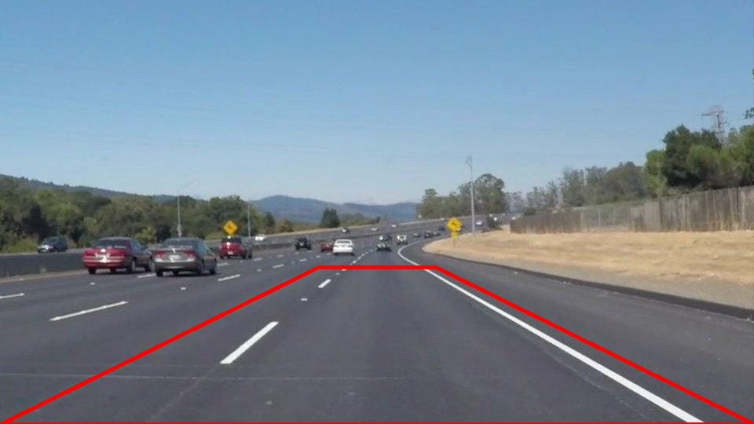
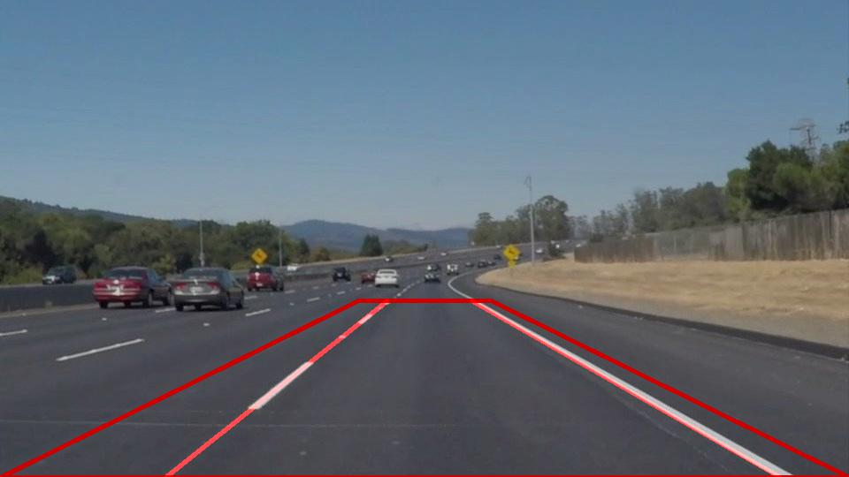

# Finding Lane Lines on the Road - Udacity Nanodegree for Self-Driving Engineer

The goals / steps of this project are the following:
* Make a pipeline that finds lane lines on the road
* Reflect on your work in a written report
---
## Current Solution:

### 1. Code Structure
First, in an effort to make the code reusable, I started a Python module to encapsulate the code created. The structure still needs work, but it's a start.

### 2. Lane Finding Pipeline
Next, I created the pipeline in a `LaneFinder` object. The pipeline method is `LaneFinder.find_lines()`. The pipeline consists of 8 basic steps (most of which were were taught in the videos).

1. [Calculate the region of interest (RI)](#21-region-of-interest-ri-shape)
1. Convert to grayscale
1. Blur the image slightly using gaussian blur
1. Use `cv2.Canny` to find edges
1. Select only the edges in the RI
1. Use `cv2.HoughLinesP` to convert the canny edges to lines
1. [Determine the left and right lane markers](#27-finding-left-and-right-lane-markers)
1. [Extrapolate left and right markers](#28-extrapolate-left-and-right-markers)

#### 2.1 Region of interest (RI) shape
To calculate the RI, the assumptions were made that:
- the RI starts in the lower corners of the image
- the RI is a trapezoid - whose top segment is centered horizontally in the frame
- the user specifies height of the RI and the width (in pixels) of the top line

Using values of height = 200 px and top_width=150, here is an example of the RI:

#### 2.7 Finding Left and right lane markers
In the region of interest, there will be many different hough-lines. To seperate the left and right lanes, the slope of each hough line was examined.

A slope cutoff was used  - which defaults to 0.5. This slope cutoff was used to group hough lines into left, right and other lines.

The equation used to group the lines was:

Infinity was used, because during a lane change, the slope will approach infinity (or negative infinity)

#### 2.8 Extrapolate left and right markers

In order to draw a single line on the left and right lanes, I modified the `draw_lines()` function by extrapolating the line bottom and line top - based on the average slope of the Hough lines grouped into left and right, and the line closest to the top of the RI

I then extended the line to the top and bottom of the RI. This left one line on the right and one on the left.

## Video Performance
Overall, the performance on the videos provided was acceptable, [but has room for improvement.](#potential-shortcomings)

<video width="300" controls>
  <source src="test_videos_output/solidWhiteRight.mp4">
</video>

## Challenge Performance
To overcome the challenge scenario, the RI vertices were updated and some of the canny thresholds were updated as well. This led to decent - but not ideal performance. For example, at a few points during the video, the lanes are no longer found.

<video width="300" controls>
  <source src="./test_videos_output/challenge.mp4">
</video>

---
## Looking Forward

### Potential Shortcomings

This solution has many potential shortcomings.

A few examples:
- what happens when lane markings disappear for a long period of time?
- how will the solution handle lane changes?
- what about curves?
- what would happen on city streets, with turns, intersecting streets, and the like?
- isn't it important to 'see' the other lanes - to allow for lane changes?
- the "type" of lane isn't determined (solid white, double yellow, etc.)

### Areas of Possible Improvement

The lanes found in the solution seem "choppy" with video. Since we're averaging the slope found only in frame `n`, the lanes appear jittery in the video.

This solution completely overlooks the time-series nature of video. Most times, there will only be subtle changes of slope and lanes between frames. This logic could be used to improve the "smoothness" of the lines and decrease the times when lines aren't found.

Additionally, we could use the lanes found in frame `n` to update the RI for frame `n+1`